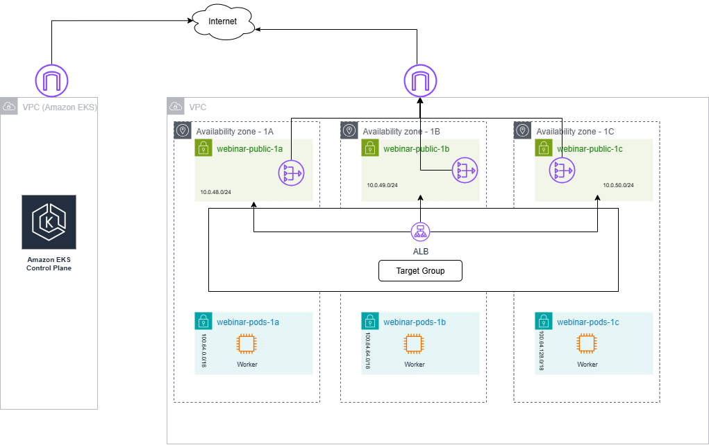
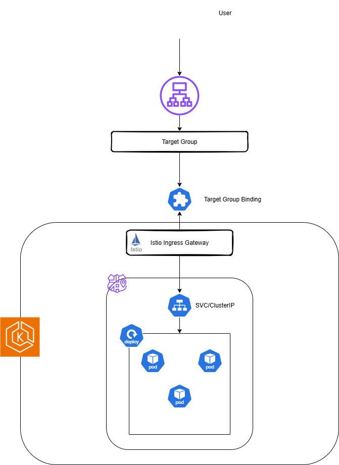
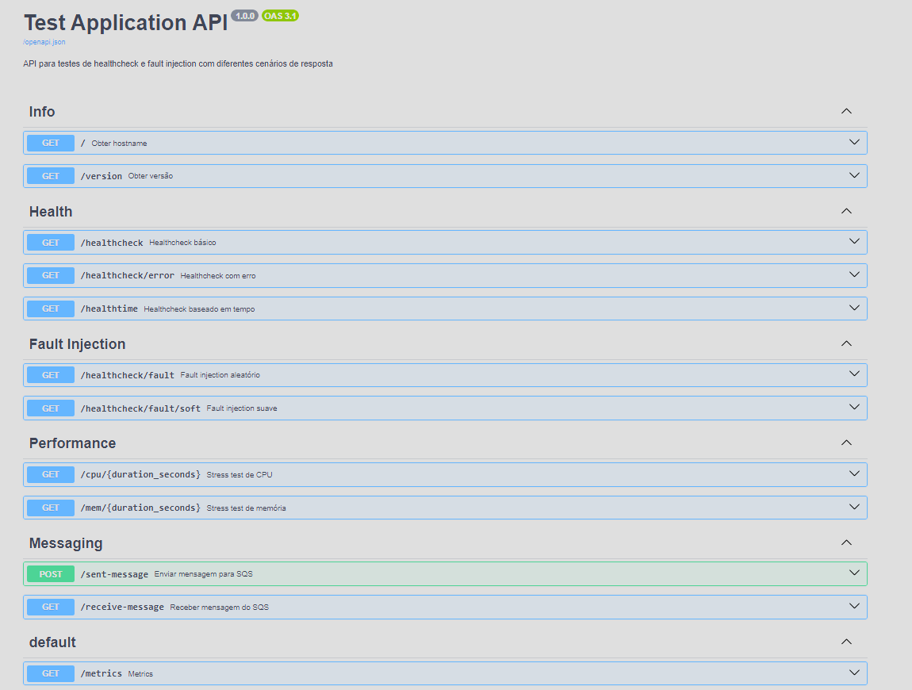
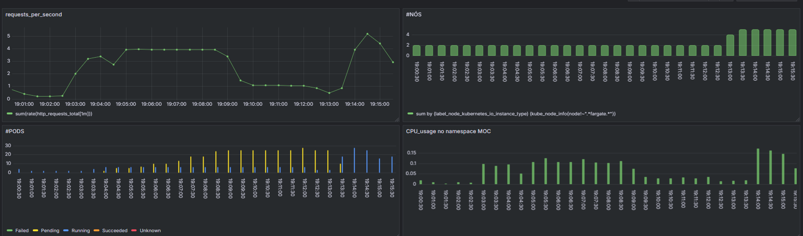
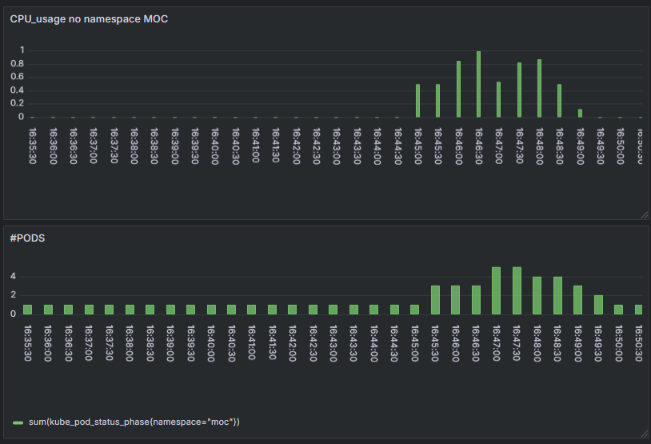
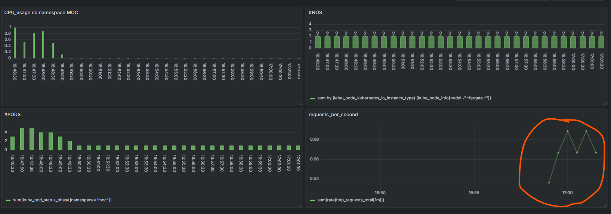
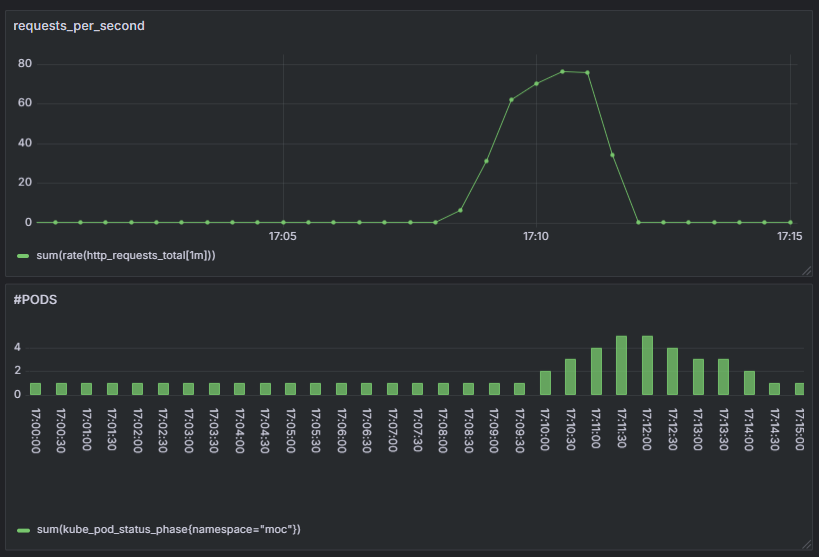
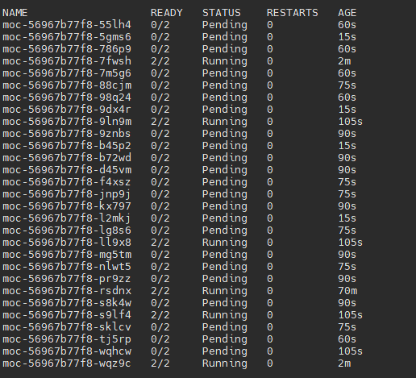
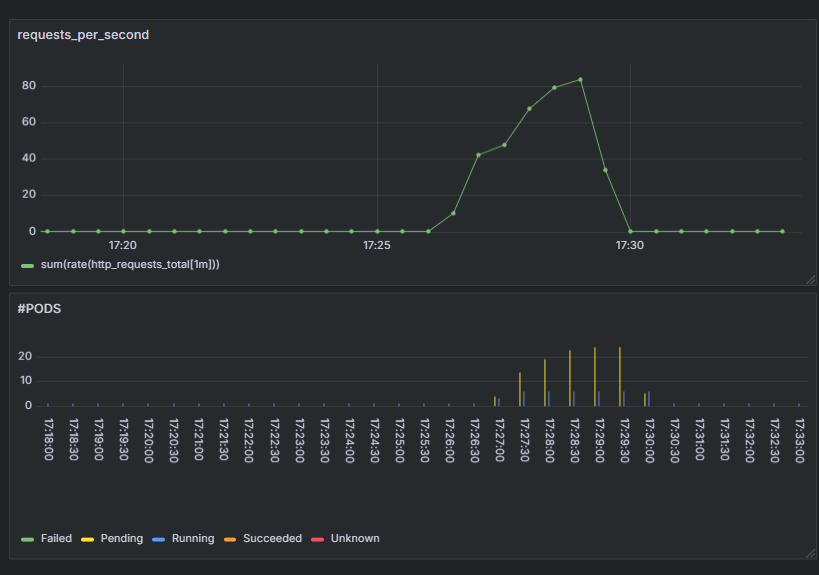

# Roteiro Webinar EKS Auto Scaling

## Lab

O laboratóro possui um VPC contendo: 

* 3 subnets públicas, cada uma em uma zona de disponibilidade
* 3 subnets para os pods e worker nodes, cada uma numa zona de disponibilidade
* Um cluster EKS com o um managed node group que tem seguintes configurações: 
    - Tipo de instâncias pode ser configurado através da variável node_instance_sizes conforme o exemplo: 
```bash  
nodes_instance_sizes = [
"t3a.large"]
``` 
    - Número mínimo, máximo e desejado de nós pode ser configurado através da variável auto_scale_options conforme o exemplo: 
```bash
auto_scale_options = {
  min     = 3
  max     = 10
  desired = 3
}
```

* Um Aplication Load Balancer com endpoint nas 3 subredes públicas um listener e um target group;

O diagrama abaixo mostra uma visão macro do cluster




A [aplicação de referência](https://github.com/cquinta/testapp) é instalada no cluster através de um manifesto que contém: 

* Um namespace -> moc
* um deploy -> moc
* um serviço do tipo ClusterIP expondo a porta 8000  -> moc
* Uma serviceaccount -> moc-user

Esta serviceaccount está linkada com a role do AWS IAM que tem permissão para escrever em filas sqs, isto é feito através do addon podidentity.

```yaml
resource "aws_eks_addon" "pod_identity" {
  cluster_name = aws_eks_cluster.main.name
  addon_name   = "eks-pod-identity-agent"

  addon_version               = data.aws_eks_addon_version.pod_identity.version
  resolve_conflicts_on_create = "OVERWRITE"
  resolve_conflicts_on_update = "OVERWRITE"

  depends_on = [
    aws_eks_access_entry.nodes
  ]
}
```

```yaml
resource "aws_eks_pod_identity_association" "sqs" {
  cluster_name    = aws_eks_cluster.main.name
  namespace       = "moc"
  service_account = "moc-user"
  role_arn        = aws_iam_role.sqs.arn
}
```


A aplicação recebe como parâmetros a região onde ela está rodando e uma fila SQS onde ela poderá escrever e ler, deletando a mensagem da fila.

```yaml
env:
        - name: SQS_QUEUE_URL
          value: "https://sqs.us-east-1.amazonaws.com/707257249187/teste" # Endpoint da Fila do SQS
        - name: AWS_REGION
          value: "us-east-1"  # Região AWS
```


Durante a instalação do Istio será criado um target group binding que linka o target group criado com o ingress gateway do Istio.

```yaml
apiVersion: elbv2.k8s.aws/v1beta1
kind: TargetGroupBinding
metadata:
  name: istio-ingress
  namespace: istio-system
spec:
  serviceRef:
    name: istio-ingressgateway
    port: 80
  targetGroupARN: ${aws_lb_target_group.main.arn}  # ARN do Target Group
  targetType: instance

```

A exposição da aplicação para a internet ocorre através do ingress gateway do Istio, conforme o diagrama abaixo: 

```yaml
apiVersion: networking.istio.io/v1alpha3
kind: Gateway
metadata:
  name: moc
  namespace: moc
spec:
  selector:
    istio: ingressgateway
  servers:
  - port:
      number: 80
      name: http
      protocol: HTTP
    hosts:
    - "moc.cquinta.com" 
---
apiVersion: networking.istio.io/v1alpha3
kind: VirtualService
metadata:
  name: moc
  namespace: moc
spec:
  hosts:
  - "moc.moc.svc.cluster.local"
  - "moc.cquinta.com"
  gateways:
  - moc
  http:
  - route:
    - destination:
        host: moc
        port:
          number: 8000
    retries:
      attempts: 3
      perTryTimeout: 500ms
      retryOn: 5xx
---
```




Vamos inicicar dipsobilizando a aplicação no custer através dos seguintes manifestos: 

```bash
kubectl apply -f ./assets/moc-app.yaml
kubectl apply -f ./assets/moc-app-istio.yaml
```
Vericar se a aplciação está rodando através do endpoint do [Swagger](http://moc.cquinta.com/docs)




Verificar o estado do cluster com a aplicação rodando, antes de iniciar os testes: 
Espera-se: 
* Baixa utilização de CPU no namespace
* 3 nós no nodegroup
* 1 pod rodando a aplicação


O manifesto da aplicação estabelece, através das requests, que cada pod vai precisar de 0.25 CPU e 128 M de memória RAM para rodar 

```yaml
resources:
          requests:  # Recursos mínimos garantidos
            cpu: 250m     # 1/4 de CPU
            memory: 128Mi # 128MB de memória
          limits:    # Limites máximos
            cpu: 500m     # 1/2 de CPU
            memory: 256Mi
```

O que significa que caso o nó não possua esta quantidade de recursos disponíveis o pod vai ficar em status "pendente" e não será agendado.


A aplicação de referência expõe métricas através do endpoint /metrics

```
http_requests_total{handler="/healthcheck",method="GET",status="2xx"} 36.0
http_requests_total{handler="/docs",method="GET",status="2xx"} 1.0
http_requests_total{handler="/openapi.json",method="GET",status="2xx"} 1.0
http_requests_total{handler="/cpu/{duration_seconds}",method="GET",status="2xx"} 41.0
http_requests_total{handler="/metrics",method="GET",status="2xx"} 1.0
```

Neste lab Vamos utilizar a média do somatório das requests por segundo tirada em um minuto para disparar uma ação de autoscaling. 
Para que isto seja possível, vamos iniciar um servicemonitor para que as métricas da aplicação fiquem disponíveis no prometheus. 

```yaml
apiVersion: monitoring.coreos.com/v1
kind: ServiceMonitor
metadata:
  name: moc-sm
  namespace: moc
  
spec:
  selector:
    matchLabels:
      # Este seletor deve corresponder ao label do seu Service
      app: moc
  endpoints:
  - port: http # Deve corresponder ao nome da porta no Service
    #path: /metrics # A rota onde as métricas são expostas
    interval: 10s # Frequência de coleta
```


```bash
kubectl apply -f ./assets/moc-app-servicemonitor.yaml
```

A métrica deve ficar disponível no grafana. 

## Autoscaling de Workload

### KEDA

Vamos utilizar a integração do Keda com o prometheus 

Certifique-se de que não há nenhum hpa rodando no namespace moc

Agora vamos criar um scaledobject que monitora o número de requisições por segundo no service moc. 

Isto pode ser feito através da métrica específica, já entregue pelo servicemonitor do istio

```yaml
triggers:
  - type: prometheus
    metadata:
      serverAddress: http://prometheus-kube-prometheus-prometheus.prometheus.svc.cluster.local:9090
      metricName: istio_requests_total 
      threshold: "10" # <---- Quantidade de requisições por pod. No exemplo, 10 TPS. 
      query: |
        sum(rate(istio_requests_total{destination_service_name="moc"}[1m])) 

```

Ou através da métrica exposta pela nossa aplicação entregue ao prometheus pelo servicemonitor que acabamos de subir. 

```yaml
triggers:
  - type: prometheus
    metadata:
      serverAddress: http://prometheus-kube-prometheus-prometheus.prometheus.svc.cluster.local:9090
      metricName: istio_requests_total 
      threshold: "10" # <---- Quantidade de requisições por pod. No exemplo, 10 TPS. 
      query: |
        sum(rate(http_requests_total[1m]))
```

O Keda implementa uma definição de recurso personalizado (CRD), scaledobject que vincula uma carga de trabalho do Kubernetes (como um Deployment ou StatefulSet) a uma fonte de evento externa, definindo as regras de escalonamento automático com base em métricas. 

Ele permite que o KEDA escale aplicações de forma dinâmica, inclusive para zero réplicas, quando não há eventos para processar.

Vamos subir o scaledobject que monitora a nossa métrica no prometheus.

```bash 
kubectl apply -f ./assets/keda_scale_tps.yaml

```
Verifique que o Keda criou o scaledobject e um hpa no namespace moc

Vamos utilizar o k6 para gerar uma quantidade de requests durante um período e verificar o comportamento do HPA

```bash
k6 run ./assets/load.js
```
Isso fará com que haja um pico de requisições e um aumento do número de pods para lidar com o pico, uma vez terminado o pico o número de pods retornará ao normal. 

É possível notar que há uma quantidade de pods em estado "pending" isto ocorre por que só há 2 nós no cluster e não há recursos suficientes para garantir os requests no 


## Autoscaling do Cluster

Para tratar o autoscale do cluster vamos iniciar o Karpenter com dois nodepools, um com instâncias spot e outro com instâncias ondemand. 

Para iniciar o Karpenter é preciso setar a variável "criar_karpenter" como true no terraform.tfvars e aplicar as modificações. 

É possível notar que a quantidade de nós passou a subir de forma a acomodar os novos pods 



Vamos verificar os nodepools 

```bash
kubectl get nodepools 

```

Nossa configuração possui 2 nodepools -> spotpool e ondemandpool

O spotpool cria instancias spot e o ondemandpool cria instâncias ondemand. 

Para mostrar como podemos influenciar a estratégia de criação de instâncias do karpenter montamos uma estratégia em que será criada 1 instância ondemand para cada 3 instâncias spot. Esta estratégia visa mitigar o risco de término inesperado de instâncias spot garantindo uma quantidade mínima de instâncias ondemand. 

A estratégia se baseou na chave capacity-spread:

**Nodepool spotpool**

```Yaml
name            = "spotpool"
    workload        = "spotpool"
    ami_family      = "Bottlerocket"
    ami_ssm         = "/aws/service/bottlerocket/aws-k8s-1.31/x86_64/latest/image_id"
    instance_family = ["t3", "t3a", "c6", "c6a", "c7", "c7a"]
    instance_sizes  = ["large", "xlarge", "2xlarge"]
    #capacity_type      = ["spot", "on-demand"]
    capacity_type      = ["spot"]
    capacity_spread    = ["b","c","d"]
    availability_zones = ["us-east-1a", "us-east-1b", "us-east-1c"]
```

**Nodepool ondemandpool**

```yaml
name            = "ondemandpool"
    workload        = "ondemandpool"
    ami_family      = "Bottlerocket"
    ami_ssm         = "/aws/service/bottlerocket/aws-k8s-1.31/x86_64/latest/image_id"
    instance_family = ["t3", "t3a", "c6", "c6a", "c7", "c7a"]
    instance_sizes  = ["large", "xlarge", "2xlarge"]
    #capacity_type      = ["spot", "on-demand"]
    capacity_type      = ["on-demand"]
    capacity_spread    = ["a"]
    availability_zones = ["us-east-1a", "us-east-1b", "us-east-1c"]
```

Nossa aplicação é então configurada para respeitar o capacity-spread distribuindo igualmente os pods através dos labels dos nós.

```yaml
# Descomentar para o karpenter
      #topologySpreadConstraints:
      #- maxSkew: 1
      #  topologyKey: capacity-spread
      #  whenUnsatisfiable: DoNotSchedule
      #  labelSelector:
      #    matchLabels:
      #      app: moc
```

Agora vamos testar o autosaling do cluster em conjunto com o autoscaling de workloads em um contexto de producer/consumer utlizando como métrica o número de mensagens em uma fila SQS. 

Para isto vamos utlizar a integração do Keda com o serviço SQS

Para isto a role utilizada pelo Keda precisa ter o principal AWS configurado

```yaml
#principals {
    #  type        = "AWS"
    #  identifiers = ["arn:aws:iam::707257249187:role/webinar-infnet-keda"]
    #}
```


```yaml
- type: aws-sqs-queue
    authenticationRef:
      name: keda-trigger-auth-aws-credentials
    metadata:
      awsRegion: us-east-1
      queueURL: https://sqs.us-east-1.amazonaws.com/707257249187/teste
      queueLength: "10" # <---- Quantidade de mensagens na fila. No exemplo, 20 mensagens. 
      identityOwner: operator

```


## Outros Testes


### HPA

Para testar o autoscaling nativo do Kubernetes vamos utilizar um HPA que dispara pods a partir do uso de CPU 

```yaml

spec:
  scaleTargetRef:
    apiVersion: apps/v1
    kind: Deployment
    name: moc  # Deployment alvo do autoscaling
  minReplicas: 1    # Mínimo de 1 pod
  maxReplicas: 5    # Máximo de 5 pods
  metrics:
  - type: Resource
    resource:
      name: cpu
      target:
        type: Utilization
        averageUtilization: 60  # Target de 60% de CPU
````

```bash
kubectl apply -f ./assets/moc-hpa-cpu.yaml
```

Para verificar o estado do HPA utilizar 
```bash 
kubectl get hpa -n moc
```

A aplicação de referência possui um endpoint que queima CPU "/cpu" então uma chamada no endpoint "/cpu/3" por exemplo queima cpu por 3 segundos. 
Vamos utilizar o seguinte script

```bash
while true; do curl moc.cquinta.com/cpu/3; sleep 5; echo;done
```
Num primeiro momento este script vai fazer com que o consumo e CPU suba e sejam lançados mais pods, o que vai permitir que o consumo médio de CPU diminua 




Agora vamos criar um adapter do prometheus que exponha a métrica desejada na api de métricas customizadas. 

```yaml
prometheus:
  # Value is templated
  url: http://prometheus-kube-prometheus-prometheus.prometheus.svc.cluster.local
  port: 9090
  path: ""


rules:
  custom:
    - seriesQuery: '{__name__=~"^http_requests_total$"}'
      resources:
        template: <<.Resource>>
      name:
        matches: "^http_requests_total$"
        as: "http_requests_per_second"
      metricsQuery: sum(rate(<<.Series>>{<<.LabelMatchers>>}[1m])) by (<<.GroupBy>>)

```

O adapter acima cria a métrica http_requests_per_second conforme indicado. 

Para instalar o adapter, alterar o valor da varíavel "criar_metrics_adapter" para "true" no terraform.tfvars e aplicar as modificações. 

Após a instalação do adapter a métrica passa a ficar visível 




Vamos iniciar um HPA que dispara um sacale up quando o valor da métrica passar de 10 

```yaml
metrics:
  - type: Pods
    pods: # O bloco 'pods' contém tanto 'metric' quanto 'target'
      metric:
        name: http_requests_per_second
      target: # <- Corretamente indentado DENTRO de 'pods'
        type: AverageValue
        averageValue: "10"
```

```bash
kubectl apply -f ./assets/moc-hpa-metric.yaml
```

Vamos utilizar o k6 para gerar uma quantidade de requests durante um período e verificar o comportamento do HPA

```bash
k6 run ./assets/load.js
```
Isso fará com que haja um pico de requisições e um aumento do número de pods para lidar com o pico, uma vez terminado o pico o número de pods retornará ao normal. 



É possível notar que há uma quantidade de pods em estado "pending" isto ocorre por que só há 2 nós no cluster e não há recursos suficientes para garantir os requests no 






Para testar a integração do Keda com eventos exteriores ao cluster, vamos testar um scaledobject que dispara uma ação de autoscale quando o número de mensagens em uma fila SQS passa de um determinado valor. 

Certifique-se de que não há nenhum hpa e nem scaledobject rodando no namespace moc.

Na aplicação de referencia há um endpoint que envia mensagens para a fila SQS passada como variável de ambiente "sent-message" e um endpoint que deleta mensagens da fila "receive-message"

vamos iniciar um deploy chamado consumer que roda o endpoint receive message de 5 em 5 segundos

```yaml
- name: curl-container
        image: curlimages/curl:latest
        command: ["/bin/sh", "-c"]
        args:
        - |
          while true; do
            curl moc.moc.svc.cluster.local:8000/receive-message;
            sleep 5;
          done

```
Vamos rodar a aplicação consumer

```bash
kubectl apply -f ./assets/moc-consumer.yaml
```


Agora vamos iniciar o scaledobject

```bash
kubectl apply -f ./assets/keda_scale_consumer.yaml
```

Vamos iniciar um loop que escreva mensagens na fila através do endpoint /sent-message
```bash
while true; do curl -X 'POST'   'http://moc.cquinta.com/sent-message'   -H 'accept: application/json'   -H 'Content-Type: application/json'   -d '{
  "message": "hello webinar!!"
}'; echo ; done

```


Conforme o número de mensagens na fila sobre podemos verificar o número de pods subindo, é possível notar também que alguns pods ficam em estado "pending" significando que não houve recursos para agendá-los. 

Este problema pode ser mitigado através do autoscale do cluster

## Autoscaling do Cluster

Para tratar o autoscale do cluster vamos iniciar o Karpenter com dois nodepools, um com instâncias spot e outro com instâncias ondemand. 

Para iniciar o Karpenter é preciso setar a variável "criar_karpenter" como true no terraform.tfvars e aplicar as modificações. 

É possível notar que a quantidade de nós passou a subir de forma a acomodar os novos pods 


Vamos verificar os nodepools 

```bash
kubectl get nodepools 

```

Nossa configuração possui 2 nodepools -> spotpool e ondemandpool

O spotpool cria instancias spot e o ondemandpool cria instâncias ondemand. 

Para mostrar como podemos influenciar a estratégia de criação de instâncias do karpenter montamos uma estratégia em que será criada 1 instância ondemand para cada 3 instâncias spot. Esta estratégia visa mitigar o risco de termino inesperado de instâncias spot garantindo uma quantidade mínima de instâncias ondemand. 

A estratégia se baseou na chave capacity-spread:

**Nodepool spotpool**

```Yaml
name            = "spotpool"
    workload        = "spotpool"
    ami_family      = "Bottlerocket"
    ami_ssm         = "/aws/service/bottlerocket/aws-k8s-1.31/x86_64/latest/image_id"
    instance_family = ["t3", "t3a", "c6", "c6a", "c7", "c7a"]
    instance_sizes  = ["large", "xlarge", "2xlarge"]
    #capacity_type      = ["spot", "on-demand"]
    capacity_type      = ["spot"]
    capacity_spread    = ["b","c","d"]
    availability_zones = ["us-east-1a", "us-east-1b", "us-east-1c"]
```

**Nodepool ondemandpool**

```yaml
name            = "ondemandpool"
    workload        = "ondemandpool"
    ami_family      = "Bottlerocket"
    ami_ssm         = "/aws/service/bottlerocket/aws-k8s-1.31/x86_64/latest/image_id"
    instance_family = ["t3", "t3a", "c6", "c6a", "c7", "c7a"]
    instance_sizes  = ["large", "xlarge", "2xlarge"]
    #capacity_type      = ["spot", "on-demand"]
    capacity_type      = ["on-demand"]
    capacity_spread    = ["a"]
    availability_zones = ["us-east-1a", "us-east-1b", "us-east-1c"]
```

**Aplicação Consumer**
```yaml
topologySpreadConstraints:
      - maxSkew: 1
        topologyKey: capacity-spread
        whenUnsatisfiable: DoNotSchedule
        labelSelector:
          matchLabels:
            app: consumer

```


